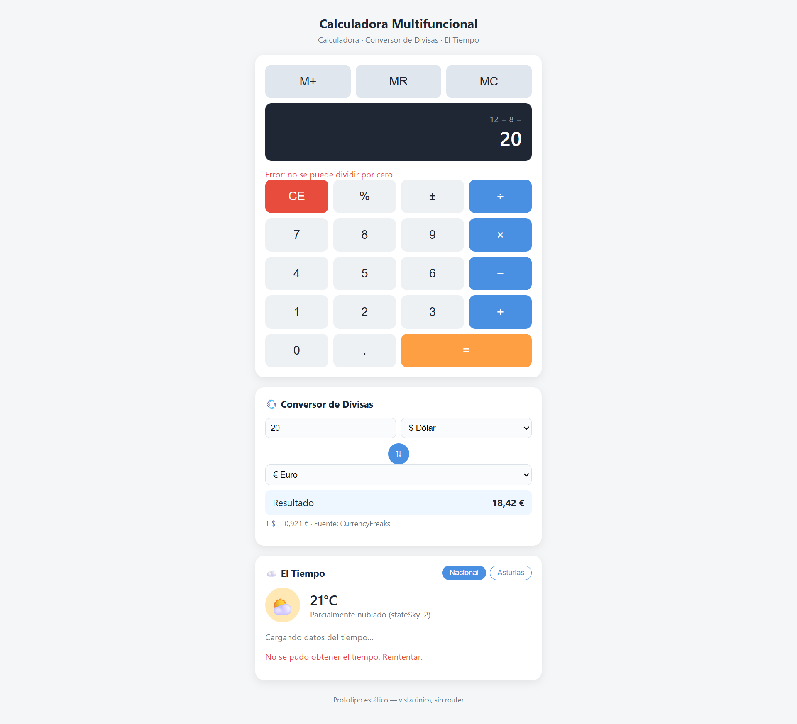
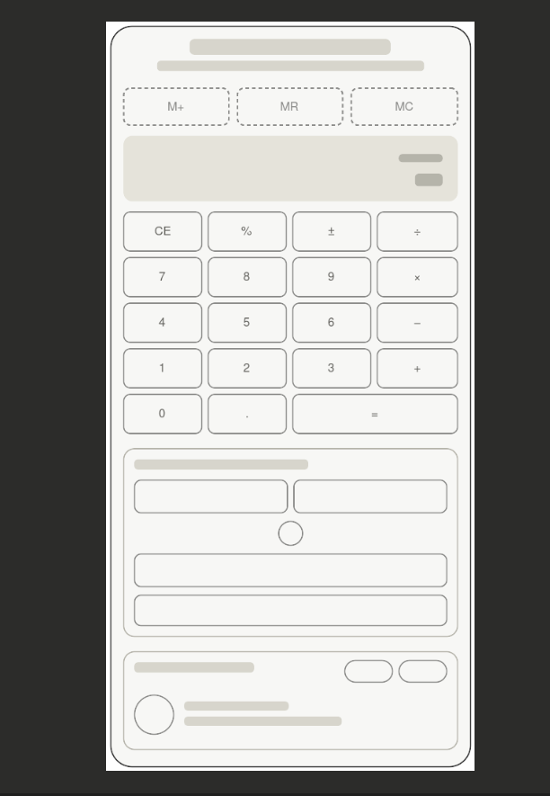
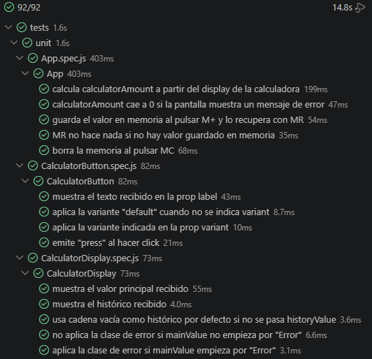
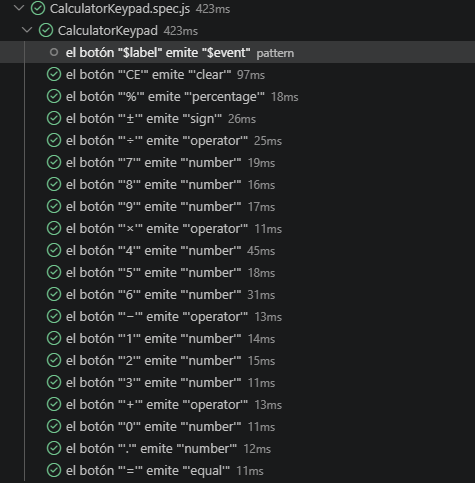
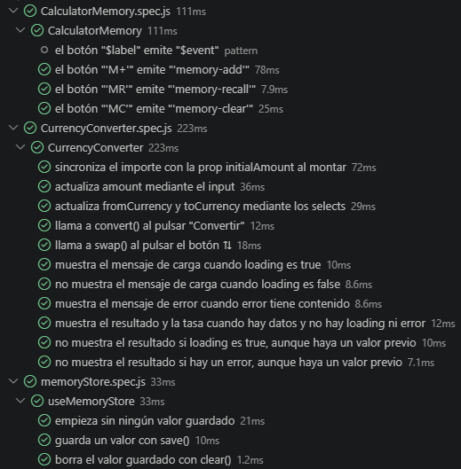
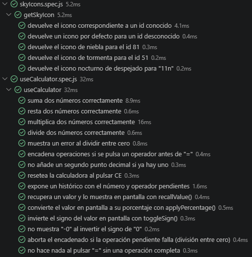
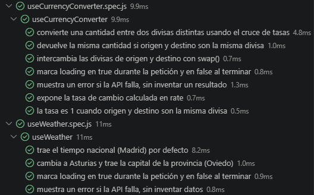
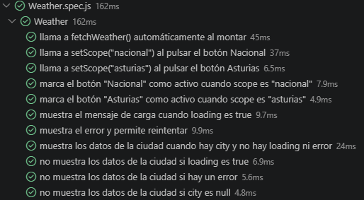
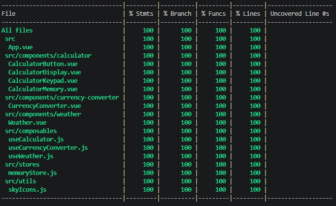
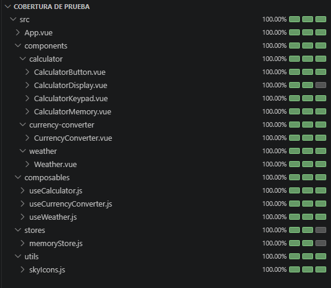

# Calculadora Multifuncional (Vue 3)

## 🔍 Índice

- [Descripción](#descripción)
- [Estructura de carpetas](#estructura-de-carpetas)
- [Instalación y variables de entorno](#-instalación-y-variables-de-entorno)
- [Scripts disponibles](#️-scripts-disponibles)
- [Testing](#testing)
- [Historias de Usuario y Criterios de Aceptación](#historias-de-usuario-y-criterios-de-aceptación)
- [Capturas](#capturas)
- [Autora](#autora)

---

## Enlace Github Pages

[Calculator-VUE](https://duran-ni.github.io/Calculator-with-Currency-Converter-and-The-Weather-VUE/)

## 📝 Descripción

Aplicación de página única (sin router) que combina tres módulos:

1. **Calculadora básica** — suma, resta, multiplicación y división, con teclas numéricas (0-9), operadores (+ − × ÷), igual (=), coma (.) y borrado (CE). Incluye control de errores (división por cero, entradas inválidas).
2. **Conversor de divisas** — integrado en la propia calculadora. Convierte entre Euro (€), Dólar ($) y Yen (¥) usando la API de [CurrencyFreaks](https://currencyfreaks.com/).
3. **El Tiempo** — consulta la API de [el-tiempo.net](https://www.el-tiempo.net/api) y muestra una imagen acorde al `stateSky` devuelto. Permite elegir entre información nacional o de Asturias.

### 📥 Extra (opcional)

- **M+ / MR / MC**: memoria de calculadora persistida con **Pinia** (guardar, recuperar y borrar el valor en memoria).
- **% / ±**: porcentaje y cambio de signo del valor en pantalla.

### 💻 Tecnologías utilizadas

* Vue 3
* Vite
* Axios
* Pinia
* Vitest + @vue/test-utils
* Playwright

Diseño Mobile First con CSS/Sass y metodología BEM. Sin Vue Router: toda la funcionalidad vive en una única vista.

---

## 📁 Estructura de carpetas

```
.
├── README.md
├── index.html
├── package.json
├── vite.config.js          # Config de Vite + Vitest (test, coverage)
├── playwright.config.js    # Config de Playwright (e2e)
├── .env.example
├── public/
│   └── favicon.svg
├── src/
│   ├── App.vue
│   ├── main.js
│   ├── assets/
│   │   ├── imgs/            # Capturas usadas en este README
│   │   └── styles/
│   │       ├── main.scss
│   │       └── base/
│   │           ├── _reset.scss
│   │           └── _variables.scss
│   ├── components/
│   │   ├── calculator/
│   │   │   ├── CalculatorButton.vue
│   │   │   ├── CalculatorDisplay.vue
│   │   │   ├── CalculatorKeypad.vue
│   │   │   └── CalculatorMemory.vue
│   │   ├── currency-converter/
│   │   │   └── CurrencyConverter.vue
│   │   └── weather/
│   │       └── Weather.vue
│   ├── composables/
│   │   ├── useCalculator.js
│   │   ├── useCurrencyConverter.js
│   │   └── useWeather.js
│   ├── stores/
│   │   └── memoryStore.js
│   └── utils/
│       └── skyIcons.js
└── tests/
    ├── unit/    # Vitest + @vue/test-utils (lógica, store, utils y componentes)
    └── e2e/     # Playwright (flujos completos en navegador real)
```

## 📦 Instalación y variables de entorno

**1.** Clonar el repositorio y entrar en la carpeta del proyecto.

**2.** Instalar las dependencias:
```bash
   npm install
```
**3.** Crear un archivo `.env` en la raíz (usa `.env.example` como plantilla) con tu propia API key de CurrencyFreaks:

VITE_CURRENCYFREAKS_API_KEY=tu_api_key_aqui

Se puede obtener una key gratuita registrándote en [currencyfreaks.com](https://currencyfreaks.com/). El módulo de El Tiempo (el-tiempo.net) no necesita API key, es abierta.

**4.** Arranca el servidor de desarrollo:
```bash
   npm run dev
```

## ⚙️ Scripts disponibles

| Script | Descripción |
| --- | --- |
| `npm run dev` | Arranca el servidor de desarrollo de Vite. |
| `npm run test:unit` | Ejecuta los tests unitarios y de componentes (Vitest) una vez. |
| `npm run test:coverage` | Ejecuta los tests unitarios y genera el informe de cobertura. |
| `npm run test:e2e` | Ejecuta los tests end-to-end con Playwright. |

## ✅ Testing

- **Unitario y de componentes (Vitest + @vue/test-utils):** 92 tests cubriendo toda la lógica de negocio (composables `useCalculator`, `useCurrencyConverter`, `useWeather`), el store de Pinia (`memoryStore`), la utilidad de iconos (`skyIcons`) y todos los componentes `.vue`. **100% de cobertura** (statements, branches, funciones y líneas).

- **End-to-end (Playwright):** 3 tests que abren la aplicación en un navegador real y comprueban los tres flujos principales: una operación completa en la calculadora, una conversión de divisas, y el cambio entre tiempo nacional y de Asturias.

---

## 📋 Historias de Usuario y Criterios de Aceptación

### Épica 1 — Calculadora básica

#### HU-01: Operaciones aritméticas básicas

**Como** usuario, **quiero** realizar sumas, restas, multiplicaciones y divisiones, **para** resolver cálculos rápidos desde la aplicación.

**Criterios de aceptación:**

- **Dado** que introduzco dos números y un operador (+, −, ×, ÷), **cuando** pulso "=", **entonces** la pantalla muestra el resultado correcto.

- **Dado** que estoy realizando una operación, **cuando** pulso otro operador antes de "=", **entonces** la aplicación encadena el cálculo con el resultado parcial.

- **Dado** que el resultado tiene decimales, **cuando** se muestra en pantalla, **entonces** se usa el separador "." como coma decimal.

- **Dado** que no he introducido una operación completa, **cuando** pulso "=", **entonces** la aplicación no lanza error y mantiene el valor actual.

#### HU-02: Teclado numérico y de operadores

**Como** usuario, **quiero** disponer de teclas del 0 al 9, los cuatro operadores, el signo igual y el punto decimal, **para** componer cualquier operación.

**Criterios de aceptación:**

- **Dado** que estoy en la pantalla principal, **cuando** pulso cualquier tecla numérica (0-9), **entonces** el dígito se añade a la pantalla principal.

- **Dado** que ya hay un punto decimal en el número actual, **cuando** pulso "." de nuevo, **entonces** no se añade un segundo punto.

- **Dado** que tengo un número en pantalla, **cuando** pulso un operador, **entonces** el operador queda reflejado en la pantalla secundaria (histórico de la operación).

#### HU-03: Tecla CE (reset)

**Como** usuario, **quiero** una tecla CE, **para** reiniciar la calculadora en cualquier momento.

**Criterios de aceptación:**

- **Dado** que hay una operación en curso o un resultado en pantalla, **cuando** pulso "CE", **entonces** la pantalla principal y la secundaria se ponen a "0" y se limpia cualquier error mostrado.

#### HU-04: Control de errores

**Como** usuario, **quiero** que la calculadora gestione errores comunes, **para** no obtener resultados incorrectos o que la aplicación se rompa.

**Criterios de aceptación:**

- **Dado** que intento dividir un número entre 0, **cuando** pulso "=", **entonces** se muestra un mensaje de error ("No se puede dividir por cero") y no se muestra `Infinity` ni `NaN`.

- **Dado** que se produce un error, **cuando** pulso cualquier tecla numérica, **entonces** el error se limpia y puedo iniciar una nueva operación.

- **Dado** que el resultado de una operación excede el espacio disponible en pantalla, **cuando** se muestra en la pantalla principal, **entonces** el número se trunca o se muestra en notación abreviada sin romper el layout.

#### HU-05 (Extra): Memoria M+ / MR / MC con Pinia

**Como** usuario, **quiero** guardar, recuperar y borrar un valor en memoria, **para** reutilizar un número en cálculos posteriores.

**Criterios de aceptación:**

- **Dado** que hay un número en pantalla, **cuando** pulso "M+", **entonces** ese valor se guarda en el store de Pinia.

- **Dado** que hay un valor guardado en memoria, **cuando** pulso "MR", **entonces** ese valor se recupera y se muestra en pantalla.

- **Dado** que hay un valor guardado en memoria, **cuando** pulso "MC", **entonces** la memoria se vacía y una posterior pulsación de "MR" no recupera nada.

- **Dado** que hay un valor guardado en memoria, **cuando** permanezco en la misma sesión sin recargar completamente la página y pulso "MR", **entonces** el store de Pinia sigue conservando el último valor guardado.

#### HU-06 (Extra): Botones % y ± en la calculadora

**Como** usuario, **quiero** aplicar el porcentaje o cambiar el signo del número en pantalla, **para** agilizar cálculos comunes sin teclear operaciones adicionales.

**Criterios de aceptación:**

- **Dado** que hay un número en pantalla, **cuando** pulso "%", **entonces** el valor se convierte en su equivalente porcentual (dividido entre 100).

- **Dado** que hay un número en pantalla, **cuando** pulso "±", **entonces** el signo del número se invierte (positivo a negativo o viceversa).

- **Dado** que el valor en pantalla es "0", **cuando** pulso "±", **entonces** el valor permanece en "0" (no se muestra "-0").

### Épica 2 — Conversor de divisas

#### HU-07: Conversión entre Euro, Dólar y Yen

**Como** usuario, **quiero** convertir una cantidad entre Euro (€), Dólar ($) y Yen (¥), **para** conocer su equivalencia en otra divisa.

**Criterios de aceptación:**

- **Dado** que introduzco una cantidad y selecciono divisa de origen y destino, **cuando** se completa la conversión, **entonces** se muestra el resultado con el tipo de cambio aplicado.

- **Dado** que selecciono la misma divisa como origen y destino, **cuando** se ejecuta la conversión, **entonces** el resultado mostrado es igual a la cantidad introducida.

- **Dado** que tengo divisas de origen y destino seleccionadas, **cuando** pulso el botón de intercambio (⇅), **entonces** las divisas de origen y destino se invierten y el resultado se recalcula.

#### HU-08: Integración con la calculadora

**Como** usuario, **quiero** que el conversor tome como entrada el valor actual de la calculadora, **para** no tener que volver a escribir el número.

**Criterios de aceptación:**

- **Dado** que tengo un resultado en la pantalla de la calculadora, **cuando** abro/uso el conversor, **entonces** ese valor aparece precargado como cantidad a convertir.

- **Dado** que el conversor tiene una cantidad precargada, **cuando** modifico manualmente la cantidad en el conversor, **entonces** esta acción no altera el estado de la calculadora.

#### HU-09: Manejo de errores de la API de divisas

**Como** usuario, **quiero** ser informado si la conversión falla, **para** entender por qué no obtengo un resultado.

**Criterios de aceptación:**

- **Dado** que la API de CurrencyFreaks no responde o devuelve error, **cuando** intento convertir, **entonces** se muestra un mensaje de error claro (sin resultado inventado).

- **Dado** que he solicitado una conversión, **cuando** la petición de tipo de cambio está en curso, **entonces** se muestra un indicador de carga hasta obtener respuesta.

### Épica 3 — Módulo "El Tiempo"

#### HU-10: Consulta del tiempo nacional o de Asturias

**Como** usuario, **quiero** ver el tiempo actual a nivel nacional o de Asturias, **para** conocer las condiciones meteorológicas relevantes para mí.

**Criterios de aceptación:**

- **Dado** que accedo a la aplicación, **cuando** la vista carga por primera vez, **entonces** se muestra el tiempo nacional por defecto.

- **Dado** que estoy viendo el tiempo nacional, **cuando** pulso el botón "Asturias" y la petición se completa, **entonces** se muestran los datos meteorológicos de esa provincia.

- **Dado** que estoy en el módulo del tiempo, **cuando** cambio de ámbito (nacional ↔ Asturias), **entonces** solo se actualiza el módulo del tiempo, sin afectar a la calculadora ni al conversor.

#### HU-11: Imagen según stateSky

**Como** usuario, **quiero** ver una imagen/icono acorde al estado del cielo, **para** interpretar visualmente el tiempo de un vistazo.

**Criterios de aceptación:**

- **Dado** un valor de `stateSky` devuelto por la API, **cuando** se renderiza el módulo, **entonces** se muestra la imagen correspondiente a ese estado (p. ej. soleado, nublado, lluvia).

- **Dado** que `stateSky` no coincide con ningún valor mapeado, **cuando** se renderiza el módulo, **entonces** se muestra un icono/imagen por defecto en lugar de un espacio vacío o un error visual.

#### HU-12: Manejo de carga y errores del módulo del tiempo

**Como** usuario, **quiero** que se me informe si la información del tiempo tarda o falla, **para** saber que la aplicación sigue funcionando correctamente.

**Criterios de aceptación:**

- **Dado** que he solicitado los datos del tiempo, **cuando** la petición a la API está en curso, **entonces** se muestra un estado de carga (spinner o texto "Cargando…").

- **Dado** que he solicitado los datos del tiempo, **cuando** la API del tiempo falla o no responde, **entonces** se muestra un mensaje de error y una opción para reintentar la consulta.

### Épica 4 — Diseño y experiencia

#### HU-13: Diseño Mobile First

**Como** usuario que accede desde el móvil, **quiero** que la interfaz esté optimizada para pantallas pequeñas, **para** usar cómodamente todos los módulos sin necesidad de escritorio.

**Criterios de aceptación:**

- **Dado** que accedo desde un dispositivo móvil, **cuando** la aplicación se abre en una pantalla de ancho ≤480px, **entonces** todos los módulos (calculadora, conversor, tiempo) se muestran apilados verticalmente, legibles y sin scroll horizontal.

- **Dado** que accedo desde un dispositivo de pantalla más ancha, **cuando** la aplicación se abre en tablet/escritorio, **entonces** el layout se adapta manteniendo la usabilidad (p. ej. mayor espaciado, tamaños de botón proporcionales).

- **Dado** que estoy usando un dispositivo táctil, **cuando** interactúo con cualquier botón, **entonces** el área táctil es suficientemente grande para uso táctil (mínimo ~44x44px).

#### HU-14: Vista única sin router

**Como** usuario, **quiero** que todos los módulos estén disponibles en una sola pantalla, **para** no tener que navegar entre vistas distintas.

**Criterios de aceptación:**

- **Dado** que accedo a la URL de la aplicación, **cuando** esta carga, **entonces** calculadora, conversor de divisas y módulo del tiempo son visibles/accesibles en la misma vista, sin cambios de URL ni uso de Vue Router.

### Épica 5 — Calidad

#### HU-15: Cobertura de tests

**Como** desarrollador, **quiero** contar con tests unitarios y e2e, **para** garantizar que la lógica y los flujos principales funcionan correctamente.

**Criterios de aceptación:**

- **Dado** el proyecto, **cuando** ejecuto `npm run test:unit`, **entonces** al menos un test unitario (p. ej. lógica de la calculadora) pasa correctamente.

- **Dado** el proyecto, **cuando** ejecuto `npm run test:e2e`, **entonces** al menos un test e2e (p. ej. flujo completo de una operación en la calculadora) pasa correctamente.

---

## 📷 Capturas

### Prototipo



### Wireframe



### Tests unitarios y de componentes (92 en verde)









### Cobertura de tests (100%)



---

## ✍️ Autora

duran-ni